# PvP в ESO

*(прошу звернути увагу, що на момент написання цього тексту, поточною версією гри є u44)*

Зміст
* [Загальна інформація](#загальна-інформація)
* [Дуелі](#дуелі)
* [Поля битв](#поля-битв)
* [Сиродііл](#сиродііл)
* [Імперське Місто](#імперське-місто)
* [Як білдитися для PvP](#як-білдитися-для-pvp)
* [Як покращити гру в PvP](#як-покращити-гру-в-pvp)

*Основною метою цього гайду є загальний огляд існуючого PvP-контенту в Elder Scrolls Online (ESO), опис та пояснення основних особливостей цього режиму для залучення нових гравців до PvP у грі. Це не є гайдом на якийсь конкретний клас чи стиль гри. Це, скоріше, спроба відповісти на питання “Як працює PvP в ESO?”, “Як в нього грати?” і “Що взагалі робити?”.* 

*Тут ви знайдете основну інформацію про кожний PvP-режим, необхідну для того, щоб почати брати участь в ньому, та яка повинна полегшити перші етапи гри. Більше деталей ви зможете знайти в самій грі, на відповідних ресурсах в Інтернеті або дізнатися в інших гравців (не соромтеся писати мені, @fadich95 😉).* 

*Основний наголос в гайді робиться на тому, як створювати PvP-білди, на що звертати увагу і як ефективніше грати. Наразі на просторах Інтернету існує безліч білдів, тому головною ідеєю гайду є навчання гравців їх краще “розуміти”, вміти адаптувати під свій стиль гри та бажаний контент. Інакше кажучи, дай людині рибу, і ти її нагодуєш лише раз; навчи її ловити рибу, і вона буде годуватися нею все життя. Цей гайд – то спроба навчити інших “ловити рибу”.* 

*Останнім розділом є поради щодо покращення гри проти гравців. Вони дуже допомогли мені в свій час і це зробило гру цікавішою та зрозумілішою. Я постійно повертаюся до них і керуюся ними під час гри.*

*В тексті використовуються такі вислови як “зазвичай в PvP…”, “кращим вважається…” і т.п. Твердження обумовлені результатами аналізу безлічі інших гайдів та порад від інших гравців, а також власним досвідом гри в PvP, яким я радий поділитися з іншими гравцями-согільдійцями.*

# Загальна інформація

**PvP** (від англ. **Player versus Player**, **Гравець проти Гравця**) – то є такий режим гри, коли двоє чи більше гравців б’ють один одному пики і міряють в кого довша шаблюка.

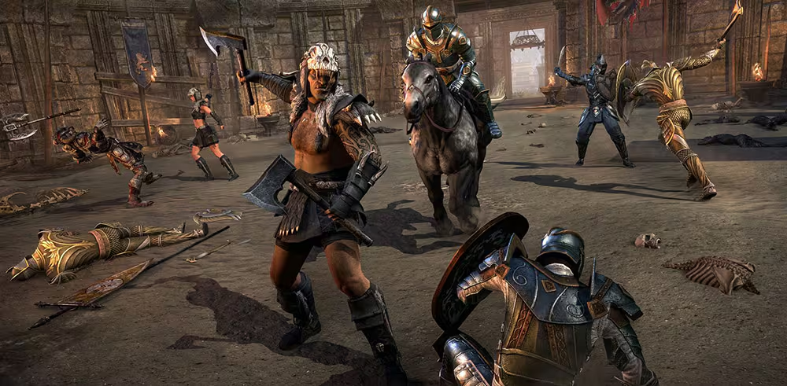

## Яке воно в ESO

Переважна більшість контенту в грі – це **PvE** (**Player versus Environment**, **Гравець проти Оточення**), тобто гра проти мобів та **NPC** (**non-playable character**, **НГП**, **негральний персонаж**). Проте в ESO існує декілька режимів, в яких гравці стикаються та змагаються проти інших гравців:

* дуелі;  
* поля битв;  
* Сиродііл;  
* Імперське Місто.

Про кожний з них детальніше описано нижче в відповідних розділах.

## Як потрапити до PvP

Для того, щоб почати змагатися проти інших гравців, насправді, нічого крім бажання не треба, хіба що 10+ рівень персонажа. Але оскільки більшість локацій в грі суто PvE-шні, гра потребує певних дій від гравця для того, щоб перейти в режим PvP. Наприклад, запропонувати дуель іншому гравцеві, який, в свою чергу, повинен прийняти цей виклик.

## Навіщо ходити в PvP

В першу чергу, це цікаво. Тобто це ще один вид контенту улюбленої гри. PvP допомагає краще і швидше орієнтуватися в ігрових механіках, таких як блок, інтеррапт (переривання касту), ролл-додж (ухилення) та в цілому вчить правильно рухатися і контролювати ресурси. Це також можливість оцінити свій рівень гри, в порівнянні з іншими гравцями.

Хоча не всі PvE-орієнтовані гравці люблять PvP-контент, рівно як і навпаки, ESO зроблене таким чином, що для повноцінної гри в будь-який з режимів не вдасться повністю уникнути іншого.

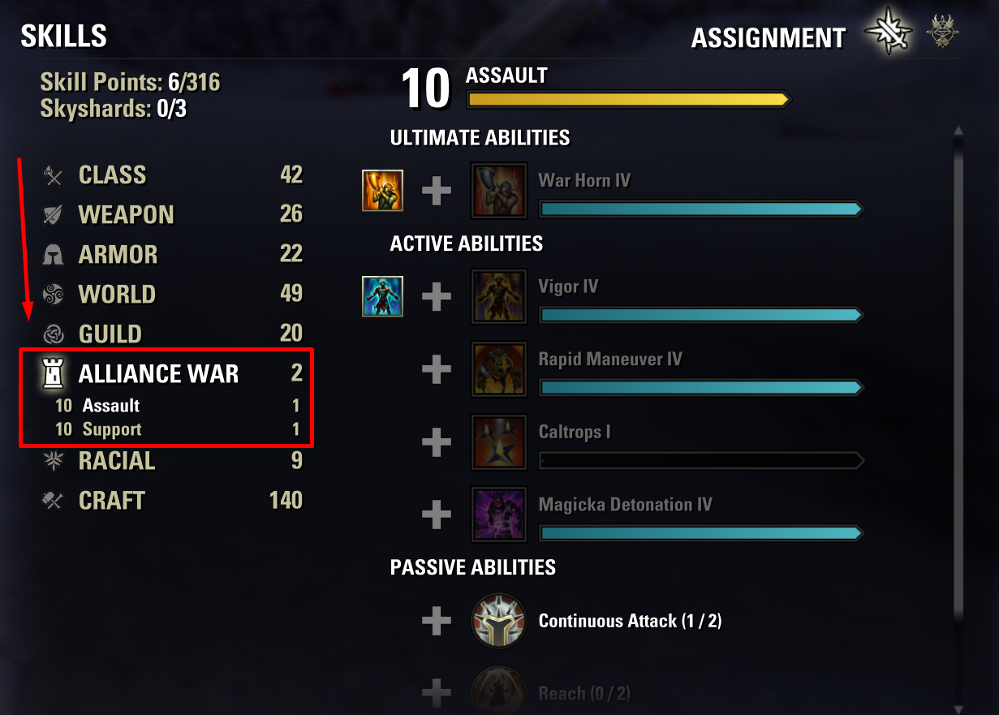

До прикладу, для PvE-саппорту потрібні  [War Horn](https://eso-skillbook.com/skill/war-horn) та [Barrier](https://eso-skillbook.com/skill/barrier), які є ультимативними скілами з PvP-шних гілок. Для PvP-саппорта в нагоді можуть стати [Energy Orb](https://eso-skillbook.com/skill/energy-orb) чи [Bone Shield](https://eso-skillbook.com/skill/bone-shield) – тобто скіли з гілки Undaunted (Безстрашних), яка прокачується за проходження PvE-контенту. PvE-DD-шок (damage dealer, наносящих шкоду) можуть зацікавити такі вміння як [Vigor](https://eso-skillbook.com/skill/vigor) або [Magicka Detonation](https://eso-skillbook.com/skill/magicka-detonation). Так чи інакше, ніхто не відмовиться від [Continuous Attack](https://eso-hub.com/en/skills/alliance-war/assault/continuous-attack), яка підвищує швидкість верхової тварини на 30%.

Наостанок, за гру в PvP дають непогані винагороди та **Очки альянсу** ([Alliance Points](https://en.uesp.net/wiki/Online:Alliance_Points), див. нижче). Також наразі PvP є *найдієвішим* способом фарму **трансмутів** ([Transmute Crystals](https://en.uesp.net/wiki/Online:Transmute_Crystals), **Кристалів Трансмутації**).

### Очки альянсу

**Очки альянсу** (**alliance points**, **AP**) – це ігрова валюта, яку гравці отримують за гру в PvP. Її можна використати для придбання *обладунків*, *зброї*, *облогового знаряддя* і *приєднання до нової кампанії* *в Сиродіілі*. 

Очки альянсу нараховують майже за будь-яку PvP активність, будь то участь у битвах за укріплення в Сиродіілі, гра на Полях Битви, вбивство суперників або виконання відповідних PvP-квестів.

# 

# PvP-Контент

Як зазначалося вище, PvP-режимів в грі існує декілька. Кожен з них має певні правила та умови здобуття перемоги.

## Дуелі

**Дуель** (**Duel**) – це режим, у якому гравець може битися з іншим гравцем у PvE-зоні (будь-якій зоні крім Сиродііла, Імперського Міста та полів битв). Доступ до дуелі можна отримати з меню взаємодії або за допомогою команди “/duel”.

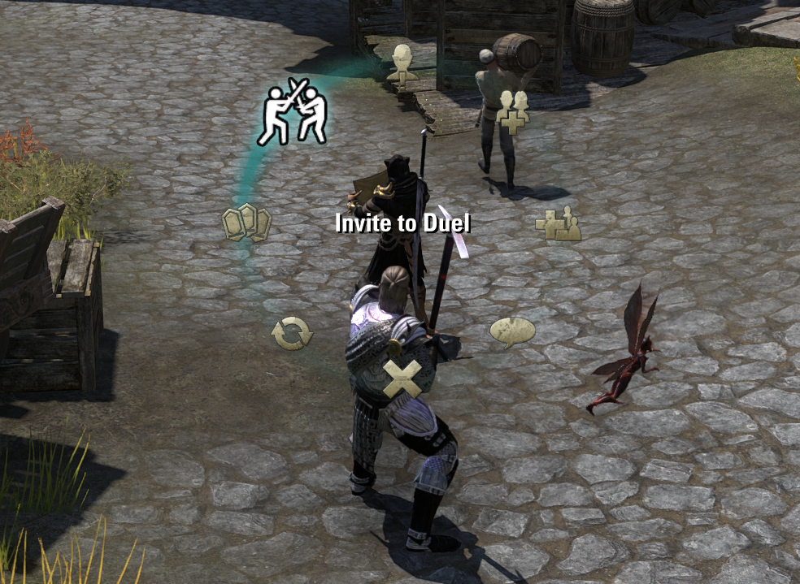

На початку дуелі у гравця є 5 секунд на підготовку, після чого починається двобій. Поєдинки зосереджуються на прапорі та повинні залишатися в межах певного радіусу від нього; якщо гравець проігнорує попередження та покине територію, це буде розглядатися як поразка.

Коли гравець досягає 0 здоров’я, інший виграє дуель, а той, що програв, може відродитися безкоштовно.

Хоча й “дуелітися” можна в будь-якій PvE-зоні – світ Тамріеля великий, тож є певні місця, де гравці збираються саме для такого різновиду змагань. Популярним місцем для дуелів є передмістя Бергами, що в локації Alik'r Desert (Пустеля Алік'р). Майже в будь-який час можна сміливо підходити туди і брати участь в двобоях з іншими PvP-шниками.

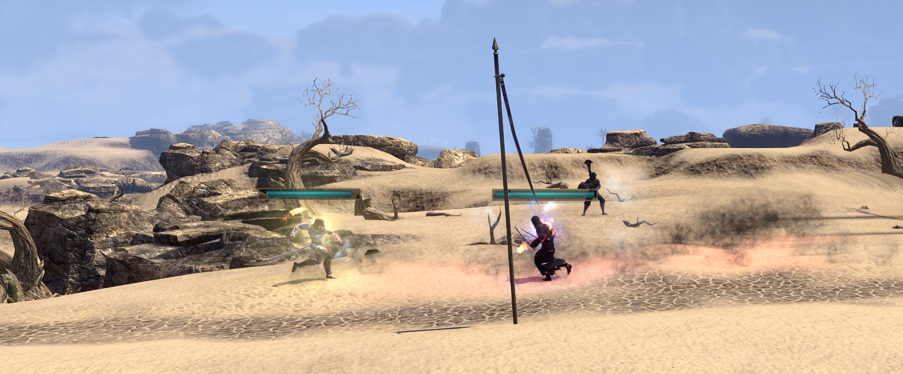

Детальніше про дуелі можна дізнатися [тут (Dueling)](https://en.uesp.net/wiki/Online:Dueling).

## 

## Поля битв 

**Поля битв** (**Battleground**, **BG**, **БГ**) – це невеликі ігрові PvP-локації, доступ до яких можна отримати за допомогою “Пошуку Груп і Активності”. 

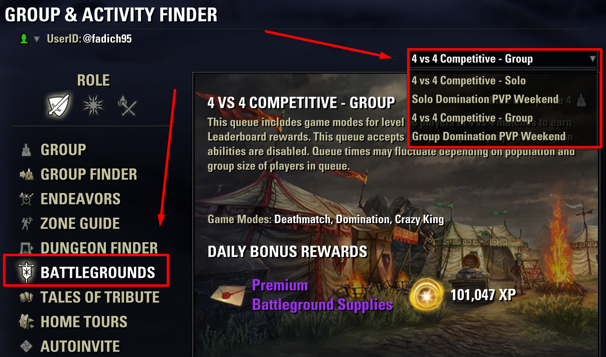

Матчі на полях битви тривають 15 хвилин або допоки одна з команд не отримує необхідну для перемоги кількість балів. Якщо протягом 15 хвилин жодна з команд не набирає переможну кількість балів, виграє та, яка має балів найбільше. На полях битв існує декілька режимів. Всі вони мають різні умови одержання переможних балів.

Детальніше про поля битв можна дізнатися [тут (Battlegrounds)](https://en.uesp.net/wiki/Online:Battlegrounds).

### Deathmatch

**Deathmatch** – це звичайна бійка насмерть. Вбивай суперника – отримуй бали.

В режимі 4v4 команди грають до трьох раундів, а виграє та команда, що перемогла в двох з них – тобто Bo3 (best of three, краще з трьох). Кожний гравець має всього 3 відродження у кожному раунді.

### Capture the Relic

**Capture the Relic** (**Захоплення Реліквії**) – це так званий режим flag-game – коли кожна з команд має на базі прапор – в ESO це реліквія, яку треба захопити та донести на свою базу – добігти і поставити до своєї реліквії. За кожну захоплену та донесену реліквію команда отримує бали.

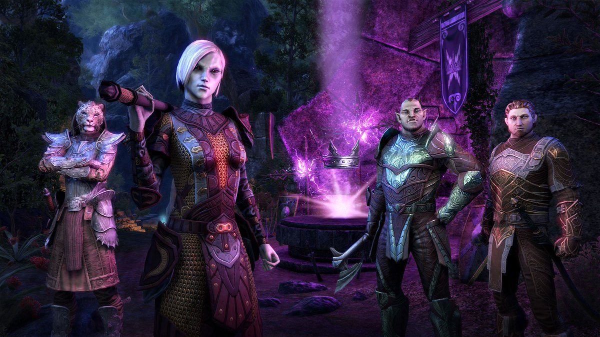

Важливо: якщо реліквії на базі немає (захоплена суперником), тоді “поставити” іншу не можна. Спочатку необхідно повернути свою, вбивши гравця, який її захопив. Після цього реліквію можна повернути або почекати декілька секунд – якщо реліквія ніким не захоплена, вона повертається на базу.

### Chaosball

**Chaosball** (**Шар Хаосу**) є ще одним різновидом flag-game. Він потребує від гравця захоплювати та отримувати Шар Хаосу, який з’являється на мапі на початку змагання. Допоки гравець утримує Шар, його команда отримує бали. 

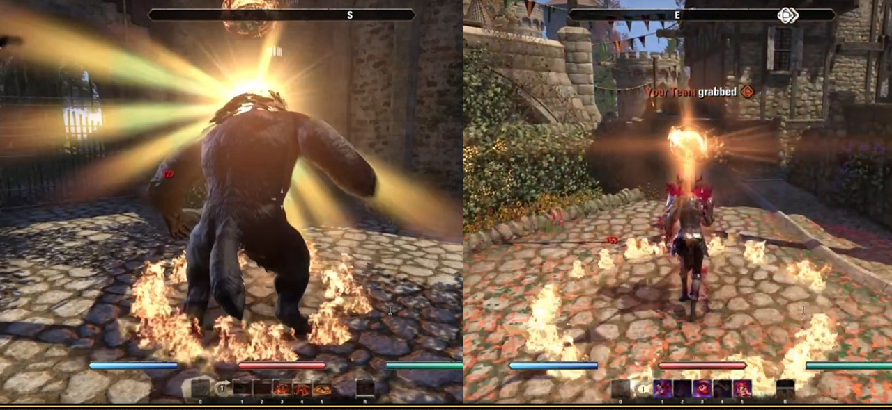

Все було б доволі просто, якби Шар не наносив шкоду облівіона гравцеві, який його тримає, а також його союзникам навколо. Шкода зростає з кожним разом, тому через певний час Шар отримувати стає доволі складно, а ще й відбиватися від суперника треба.

### Crazy King

**Crazy King** (**Божевільний Король**) – це ігровий режим з категорії “Захоплення території”. Його мета – отримати переможні бали, шляхом захоплення й утримання територій, які періодично з’являються та зникають в різних місцях.

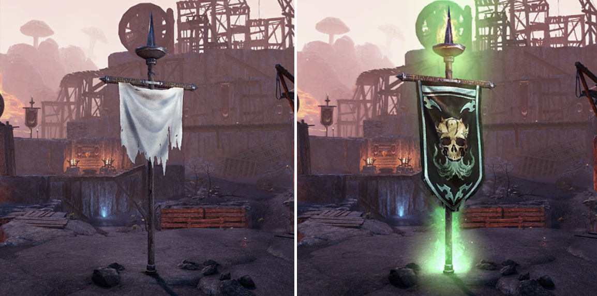

Території захоплюються гравцями, які стоять поруч із ними, та відмічаються прапорами. Коли точка з'являється в сусідньому місці, її приналежність до команди буде видалено, і вона буде готова до повторного захоплення. Звісно, можна (і треба) захоплювати й точки команди-суперника.

Якщо однакова кількість гравців стоятимуть біля точки, її захоплення припиняється для обох команд. Кількість гравців, точніше, різниця в кількості, також впливає на швидкість захоплення території.

### Domination

**Domination** (**Панування**) також відноситься до “Захоплення території”, але на відміну від режиму Crazy King, всі точки одразу з'являються і нікуди не зникають протягом всього матчу.

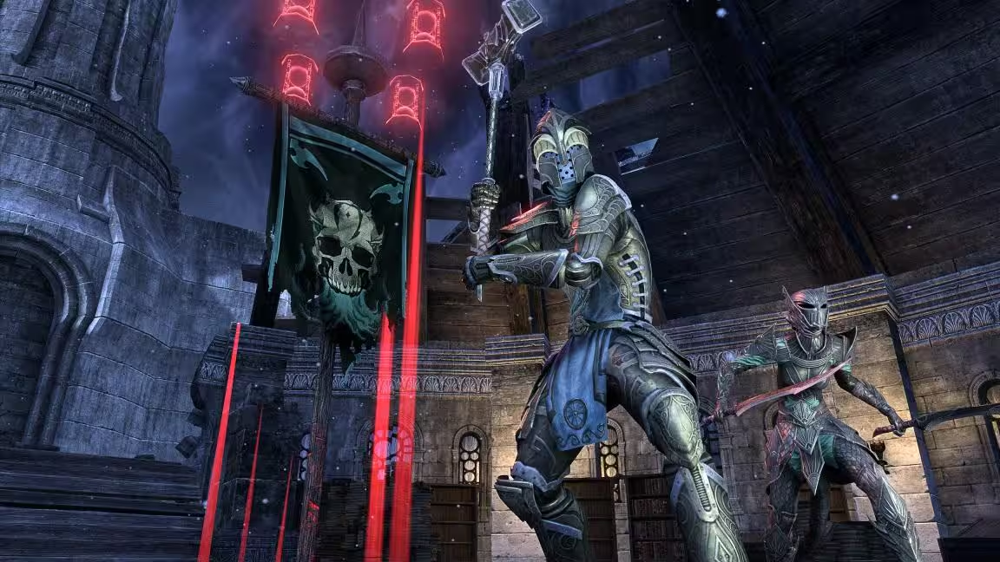

Поки точка захоплення знаходиться під контролем команди, вона приносить бали для неї.

### Корисна інформація про поля битв

#### **Реліквія та шар хаосу**

* Захоплення та повернення на базу реліквії виконується як звичайна дія – кнопка “E”. Коли персонаж розпочинає процес захоплення, будь-яка інша дія перериває його, крім руху. Можна продовжувати рухатися в межах досяжності реліквії.  
* Процес захоплення реліквії може бути перерваний звичайним *башем*.  
* Персонажам, що тримають реліквію або шар хаоса, недоступні деякі utility-скілли, такі як [Bolt Escape](https://eso-hub.com/en/skills/sorcerer/storm-calling/bolt-escape) чи [Shadow Cloak](https://eso-hub.com/en/skills/nightblade).  
* Якщо персонаж тримає реліквію, позбавитися її він вже не зможе. Допоки персонаж живий.  
* Для повернення своєї реліквії не треба доносити її на базу, на неї достатньо лише “натиснути”.  
* Персонаж не може нести більше однієї реліквії, проте може повертати реліквію на базу, тримаючи іншу.  
* На відміну від реліквії, шар хаосу, захоплюється миттєво при “натисканні” на нього, а шар, який щойно відновився – одразу захоплюється, коли персонаж до нього підходить.

#### Захоплення території

* Прапори в режимі Crazy King з’являються в певних місцях, тому можна заздалегідь передбачити місце появи наступного.  
* На деяких аренах території знаходяться поруч одна з одною. Такі території можна захоплювати одночасно, стоячи на перетині їх областей.  
* Території не можна захоплювати, знаходячись в стані невидимості або скритності (коли “око заплющене”).

#### Загальне

* Вирішивши передчасно покинути поле битви, гравець отримує штраф і деякий час після цього не може стати в чергу на БГ. Группа, що має такого гравця також не може стати в чергу, незважаючи на те, хто є її лідером.  
* Штраф розповсюджується на персонажа, тому гравець все ще може стати в чергу, зайшовши іншим.  
* На деяких полях битв з’являються бонуси, що збільшують швидкість персонажа, спротив, шкоду або генеруть ульту.  
* Усі поля битви – noCP (no champion points), тобто в них не діють зірки.

## Сиродііл 

**Сиродііл** (**Сироділ**, **Cyrodiil**) є центральною провінцією Тамріелю та домівкою імперців. Це найбільша за площею локація в грі та місце, де стикаються в битві три альянси: **Daggerfall Covenant** (Даггерфоллський Ковенант – сині), **Ebonheart Pact** (Ебонхартський Пакт – червоні) та **Aldmeri Dominion** (Алдмерський Домініон – жовті). Вибрати, за який альянс грати можна під час створення персонажу або використавши [Alliance Change Token](https://www.elderscrollsonline.com/en-us/crownstore/item/8922) (Жетон Зміни альянсу).

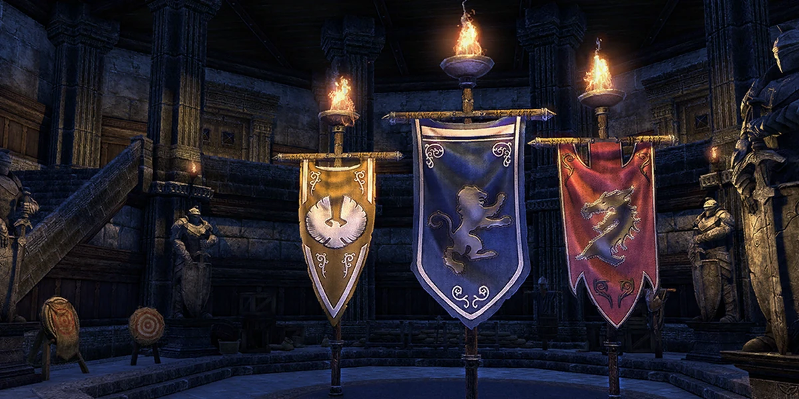

Політично регіон змінюється, оскільки армії трьох альянсів постійно борються за стратегічні позиції. Однак номінально північно-західний Сироділ вважається територією Даггерфоллського Ковенанту, північно-східний Сироділ – Ебонхартського Пакту, а південно-західний – територією Альдмерського Домініону. Залишки Імперського легіону все ще контролюють частину Імперського Міста, але про нього пізніше.

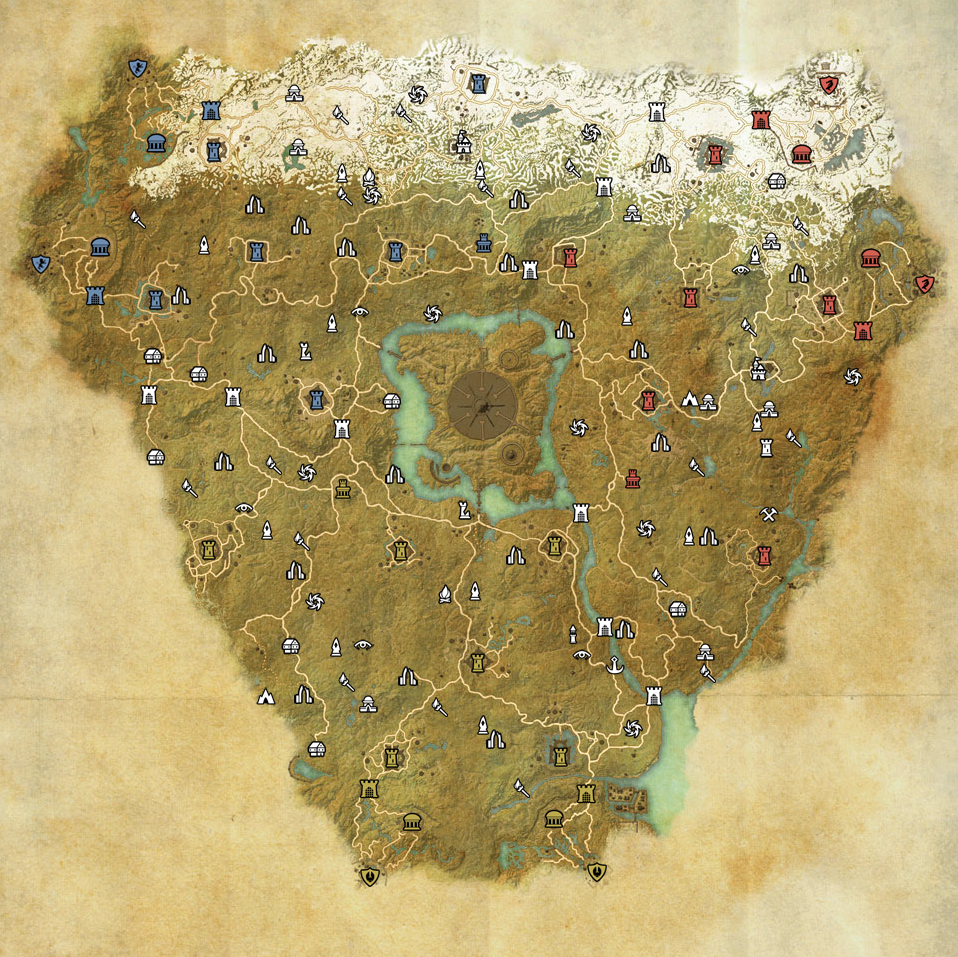

Детальніше про Сиродііл можна дізнатися [тут (Cyrodiil)](https://en.uesp.net/wiki/Online:Cyrodiil).

### Правила гри

Cyrodiil доступний після досягнення 10 рівня. Гравець може приєднатися до однієї з кількох кампаній, кожна з яких діє як різні екземпляри локації з різними параметрами. Персонажі нижче 50 рівня підвищуються до показників, які вони б мали на 50, щоб нейтралізувати різницю в рівнях між гравцями. Хоча персонажі останнього рівня все ще мають більшу перевагу в спорядженні, очках навичок тощо.

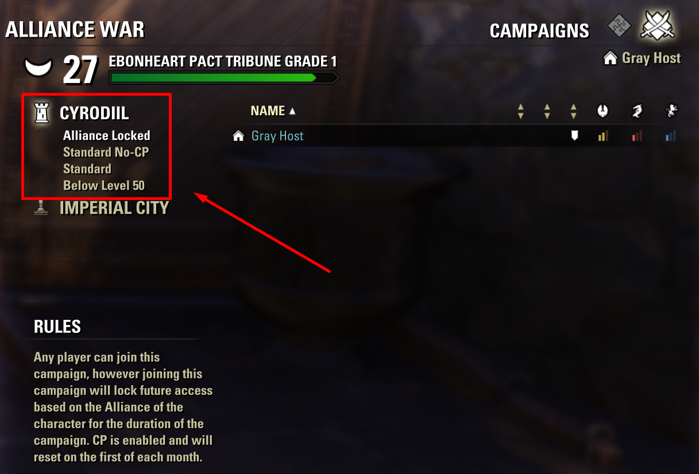

Детальніше про ігровий процес можна дізнатися [тут (Сиродііл)](https://elderscrolls.fandom.com/wiki/Cyrodiil_\(Online\)).

### Кампанії

Кампанія (Campaign) триває від тижня до місяця. Персонажі можуть брати участь в декількох кампаніях одночасно: домашній, у якій отримують повні винагороди; і гостьовій, у якій винагороди знижені. Під час кампанії результативність альянсу впливатиме на бонуси, які персонажі отримують поки перебувають в Сиродіілі, наприклад, на підвищення характеристик.

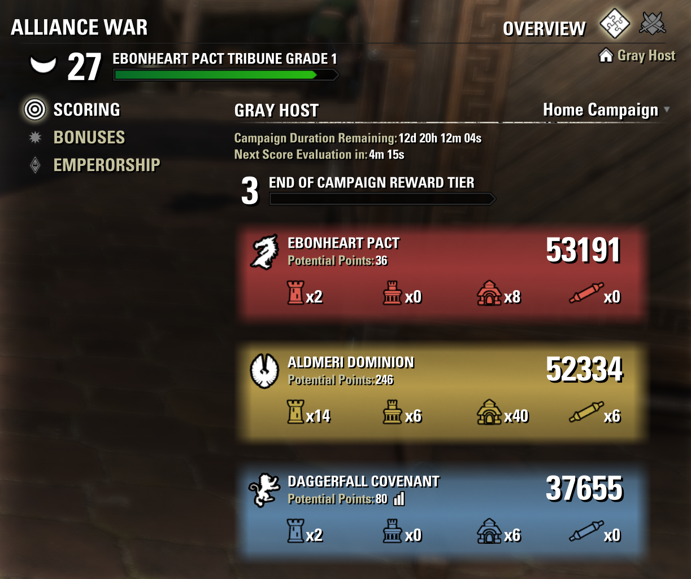

Наприкінці кампанії гравці отримують винагороди залежно від того, наскільки добре проявив себе їхній альянс. Індивідуальні винагороди базуються на внеску персонажа в продуктивність свого альянсу.

### Фортеці та форпости

За захоплення та утримання фортець (Keep), їхніх ресурсів і форпостів (Outpost) альянс отримує переможні бали та бонуси. За замовчуванням, кожен альянс контролює по 6 фортець, відомих як “Домашні”.

Кожна стіна, ворота і, в деяких укріпленнях, дах можуть бути зруйновані. Після захоплення фортеця залишається в тому ж стані та може потребувати відновлення. Для ремонту пошкоджень у фортифікаційних інтендантів (торговців) можна придбати ремонтні набори. Усередині фортеці є два прапори, які повинні триматися одним альянсом, щоб вона вважалася захопленою та приносила йому переможні бали.

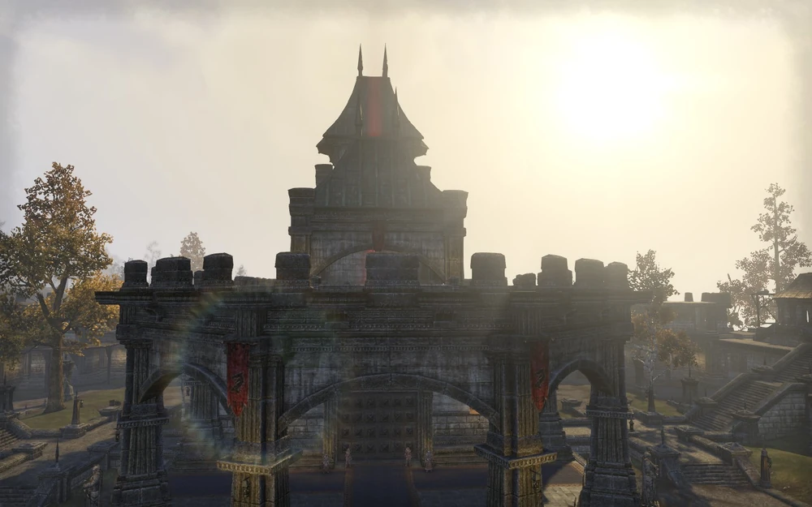

Навколо фортеці є три ресурси, які впливають на характеристики фортеці:

* **лісопилка** (**lumber mill**) допомагає зробити фортифікаційні ворота міцнішими та дозволяє їм автоматично ремонтуватися з часом;  
* **ферма** (**farm**) робить НГП-охоронців сильнішими та стійкішими;  
* **шахта** (**mine**) допомагає зміцнити стіни та дозволяє їм згодом відновлюватися. 

На кожному ресурсі є прапори захоплення, які працюють окремо від фортець. Якщо всі три ресурси контролюються ворожим альянсом, транзитний зв’язок (див. нижче) буде розірвано, а телепортація до укріплення – недоступною.

На відміну від фортець, форпости не мають зовнішніх стін та ресурсів та приносять альянсові меньше переможних балів.

### Міста

Мешканці міст Сироділу нейтрально ставляться до персонажів, але охоронці альянсу, який утримує довколишні укріплення, патрулюватимуть вулиці. Кожне місто пропонує різні повторювані квести, доступні для персонажів будь-якого альянсу незалежно від того, хто контролює місто. 

Гравці, альянс котрих контролює місто, можуть купляти у торговців предмети з наборів.

### Транзитні мережі

На відміну від інших (PvE-) зон, Сироділ не містить Дорожніх святилищ (Way Shrine) за межами баз альянсів. 

Натомість у фортецях, форпостах і містах є **Транзитні святилища** (**Transitus Shrines**), до яких можна потрапити лише з іншого підключеного. Між суміжними святилищами, які контролюються одним альянсом, формуються **Транзитні зв'язки**. Інший альянс не може отримати доступ до святилищ суперника. Транзитні святилища в фортецях стають недоступними, якщо ресурси навколо них були захоплені іншим альянсом або якщо фортеця, форпост або місто знаходиться під облогою та їхні ворота чи стіни пошкоджені щонайменше на 50%.

### Облогове знаряддя

Облогове знаряддя використовується для руйнування стін, воріт та даху, а також для нанесення шкоди персонажам супротивника. Гравцям доступні різні види требушетів, катапульт та баліст, кипляча олія, передові табори та тарани. Їх можливо купити за золото або Очки альянсу.

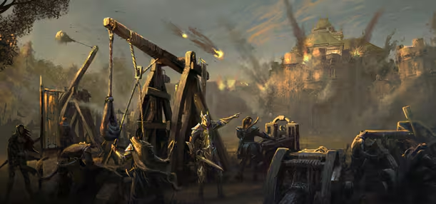

Кожне знаряддя має свої особливості і призначення. Ознайомитися з цим детальніше можна в самій грі або [тут (Siege Weapons)](https://en.uesp.net/wiki/Online:Siege_Weapons).

### Стародавні сувої

**Стародавні сувої** (**Elder Scrolls**) – це артефакти величезної сили, які забезпечують бонуси для всього альянсу. Кожен альянс за замовчуванням має два сувої та може захопити сувої суперника. Альянс отримує бонуси лише тоді, коли зберігає власні сувої на базі, а інші – в домашніх фортецях.

Кожен захоплений і підконтрольний сувій також приносить переможні бали для свого альянсу під час компанії.

### Імператор

Титул «Імператора» присуджується гравцеві, який займає найвищу позицію в таблиці лідерів альянсу, якщо його альянс контролює всі шість укріплень навколо Імперського Міста: Chalman, Aleswell, Ash, Roebeck, Alessia та Blue Road. Після коронації Імператор отримує ряд навичок, які включають можливість робити облогу більш ефективною, покращені атрибути та зниження вартості здібностей. Усі навички є пассивками і не потребують додаткових дій від гравця.

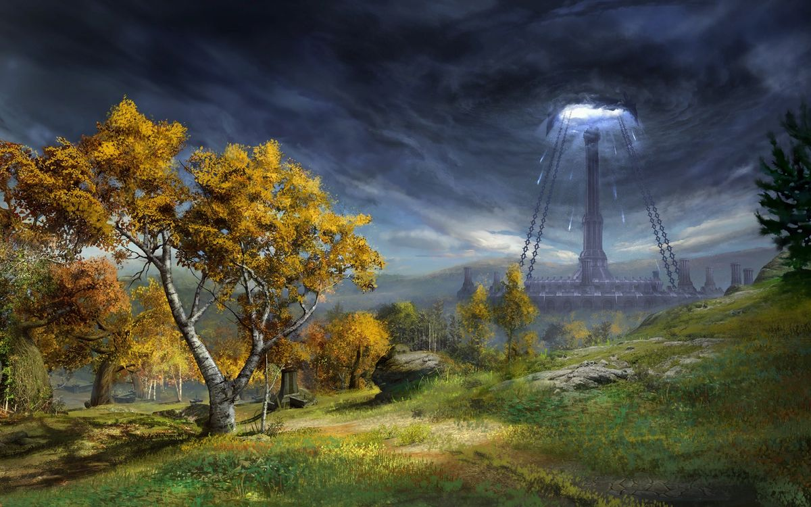

Імператора скидають з престолу, коли його альянс втрачає всі укріплення, необхідні для коронації імператора. Втрата одного або п'яти укріплень не скине Імператора з престолу, необхідні всі 6\. Повалений імператор все ще матиме доступ до лінії навичок Імператора зі зниженими перевагами, а його титул «Імператор» буде змінено на «Колишній Імператор».

### Корисна інформація про Сиродііл

#### **Телепортація**

* Хоча й телепортуватися можна лише між фортецями, що з’єднані між собою транзитною мережею; померши, гравець може відновитися у будь-якій фортеці чи місті, які контролюються його альянсом та не знаходяться під облогою.  
* Існує три способи швидкої телепортації на базу:  
  * використати камені телепортації ([Keep Recall Stones](https://elderscrolls.fandom.com/wiki/Keep_Recall_Stones));  
  * померти і відновитися біля дорожньої святилища ([Wayshrine](https://elderscrolls.fandom.com/wiki/Wayshrines_\(Online\)));  
  * примусово перенестися до іншої локації, наприклад, ставши в чергу в Імперське Місто, після чого знов стати в чергу в Сиродііл.  
* Якщо персонаж помер від нейтральних обставин (падіння або нейтральних мобів), правила відновлення діють так само як в PvE і будуть доступні опції відновлення “тут” та “біля дорожньої святилища”.

#### **Сувої**

* Сувої працюють приблизно як реліквії на БГ (див. Поля битв): на підняття треба декілька секунд, процес можно перервати, діють подібні обмеження на скіли.  
* Тримаючи сувій неможливо скористатися маунтом (верховою твариною), тому гравцеві, що захопив скролл, треба пішки з ним бігти.  
* Існує два типи сувоїв: захисні (defensive) та наступальні (offensive). Альянс має можливість захопити сувій суперника тільки в тому випадку, коли він контролює сувій того ж типу. Наприклад, для захоплення наступального сувою Альдмерського Домініону *Altadoon*, гравцеві з Ебонхартського Пакту необхідно, щоб його альянс контролював сувій *Ghartok*, інакше у гравця не буде можливості взаємодії зі скроллом, навіть якщо той буде просто “лежати в полі”.  
* Завдання на захоплення сувою розповсюджується на весь альянс, тому не обов’язково власноруч доносити його.  
* Сувій можна залишити лише в домашній фортеці.  
* Сувій вважається контрольованим лише в домашній фортеці.

#### **Облогові знаряддя**

* Можно використовувати декілька облогових знарядь одночасно: поки одне перезаряджається, можна задіяти інше (наприклад, стріляти з чотирьох баліст по черзі).  
* Біля тарану достатньо просто знаходиться, але необхідно від 3 до 6 гравців, щоб він працював.  
* Персонаж прийматиме участь у використанні тарану, навіть якщо він одночасно використовує інше знаряддя.  
* Не дозволяється використовувати знаряддя альянсу суперника, проте його можна зруйнувати (та ж сама кнопка).  
* Процес руйнації знаряддя суперника можна переривати (башем).  
* Процес використання знаряддя також переривається.  
* Знаряддя можна використовувати тільки з quick-слотів (по кнопці “Q”), які, в свою чергу, можливо налаштувати лище поза режимом бою. Тож варто заздалегідь подбати про все необхідне.

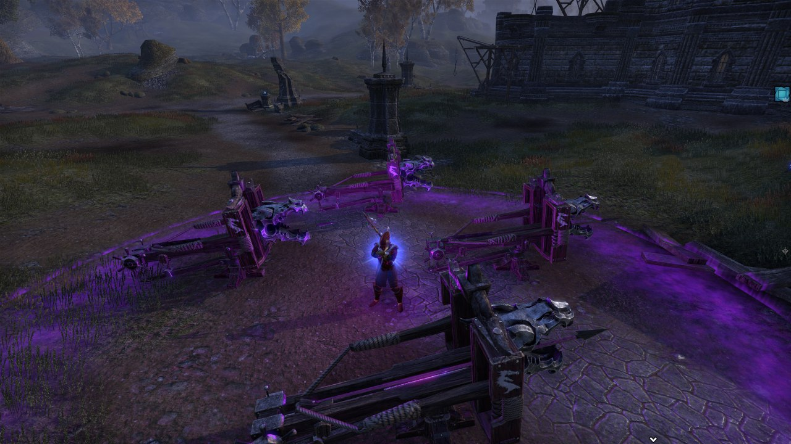

#### **Загальне**

* Захоплені міста (Брума, Кропсфорт та Властарус) не надають альянсові переможних балів, проте їх можна використовувати як телепорти.  
* Ціни у торговців в містах значно нижчі, ніж у їхніх коллег на базах альянсів.  
* За оборону нараховується більша кількість Очків альянсу, ніж за захоплення.  
* Захоплення принесе більше Очків альянсу, якщо фортеця має підконтрольні ресурси.   
* Отримання будь-якої кількості Очків альянсу не впливає на нарахування переможних балів альянсу, тільки на таблицю лідерів.  
* Підписники ESO-Plus отримують на 10% більше Очків альянсу, проте цей бонус не враховується в таблиці лідерів.  
* На базі кожного альянсу є майстерня озброєння, алтар для скрайбінгу, банкір, а також крафтові станції.  
* Кожного тижня з вечора п’ятниці до ранку понеділка на базах альянсів з’являється Golden Vendor – продавчиня-каджитка, у якої можливо придбати ювелірні прикраси з випадкових сетів, а також частини двох монстр-сетів. Товар доступний як за очки альянсу, так і за золото.

## Імперське Місто 

**Імперське Місто** (**Imperial City**) є центральним містом і столицею Сироділа та колишньої Імперії. Це **PvPvE** зона – тобто зона, в якій можна займатися як PvP, так і PvE активностями. 

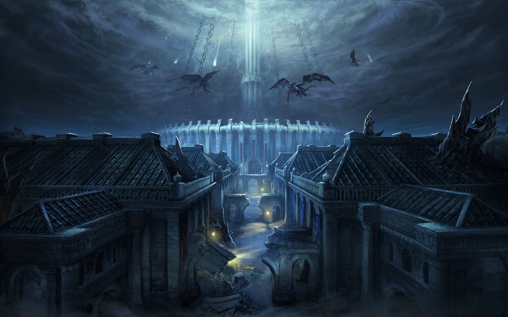

Через те, що усі мости, які ведуть до міста, заблоковані непроникними силовими полями, а спроба переплисти призведе лише до вашої швидкої смерті через забійну рибу ([Slaughterfish](https://en.uesp.net/wiki/Online:Slaughterfish)), вхід до Імперського Міста доступний для гравців лише через меню **Alliance War** (**Війна Альянсів**).

Імперське Місто складається з **Імперської Каналізації** (**Imperial Sewers**) та шести **Імперських Районів** (**Imperial Districts**). Кожен альянс має невелику базу в каналізації, яка забезпечує швидкий доступ до районів, але щоб повернутися на базу з районів, потрібно пройти через каналізацію. 

Геймплей у каналізації може нагадувати велике публічне підземелля з елементами PvP, а райони міста – поля битв з квестовими центрами.

За свою діяльність гравці отримують спеціальну валюту – **Камені Тель Вара** (**Tel Var Stones**), яку можуть витрачати на покупку артефактів, матеріалів, стилів тощо на базі альянсу.

Незалежно від того, чи цікавиться гравець PvE чи PvP, або поєднанням обох, в залишках столиці Імперії завжди можна знайти чим зайнятися.

Детальніше про Імперське Місто можна дізнатися [тут (Imperial City)](https://www.elderscrollsonline.com/en-us/news/post/25365).

### Сюжетна лінія Імперського Міста

Одне з можливих занять – проходження сюжетної лінії Імперського Міста. Сюжетка пропонує гравцеві об’єднати сили з агенткою Імперської Драконячої Варти для захисту міста від сил Молага Бала. Щоб розпочати сюжетну лінію, візьміть квест “City on the Brink” на базі свого альянсу.

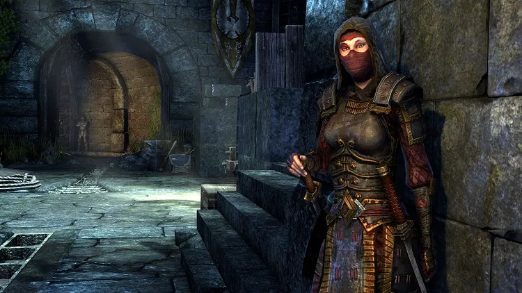

### Захоплення районів

Гравці можуть боротися за контроль над кожним із шести районів міста, завойовуючи центральні опорні пункти всередині (прапори). 

Це може бути вигідно, як для фарму Каменів Тель Вар (див. нижче), оскільки чим більше районів контролює альянс, тим більшим буде отримано Каменів Тель Вар, так і для звичайних PvP-зіткнень з іншими гравцями.

### Фарм Тель Варів

Наостанок, необхідно зазначити, бодай, найголовнішу мету походів гравців в Імперське Місто – фарм Tel Var Stone-ів.

Є кілька способів отримати ці камені. Найпростіший – вбивство монстрів в районах Імперського Міста чи Каналізації. Чим складнішим є монстр, тим більша винагорода.

Другий, більш сміливий спосіб фарму Тел Вар, – вбивства персонажів гравців протилежного альянсу. Вбивши персонажа, можна отримати половину каменів, які він носив. Але теж саме стосується і вас – ваші камені Тель Вар також переходять до іншого гравця чи моба, коли ви помрете. Так-так, моби також отримують ці камені за вбивства і, таким чином, вбивши монстра, що вбив одного або декілька гравців, можна отримати всі ці камені собі.

Будь-яка кількість Тель Варів рівномірно розподіляється між усіма, хто брав участь у битві. Наприклад, за вбивство гравця, що має 1000 каменів винагородою буде 500 Тель Варів. Якщо його перемагає один гравець – він отримує всі 500 каменів. Якщо суперника подолали командою з п’яти гравців – кожен отримує по 100\. Те саме стосується і монстрів. 

Тельварські камені також можна знайти в скринях зі скарбами в межах Імперського Міста. У цьому випадку винагороду отримує лише той гравець, хто бере камені зі скрині.

Ще одна важлива деталь, що додає азарту грі – модифікатор (множник) винагороди. Чим більше каменів має при собі гравець, тим більшою є кількість каменів, які він отримує за вбивства.

Якщо ви носите від 100 до 1000 Тель Варів – кількість каменів, які ви отримуєте від монстрів, подвоюється; від 1000 до 10000 – потроюється; понад 10 000 Тель Варів – нагорода помножується вчетверо.

Ризикувати чи ні – вирішує кожен для себе. Головне пам’ятати, що Тель Вари, як і будь-яку іншу валюту, можна зберігати у банку, але тоді персонаж їх при собі не матиме, відповідно, не матиме бонусів.

# Як білдитися для PvP 

На відміну від PvE, де суперниками є запрограмовані NPC, в грі проти інших гравців неможливо однозначно визначити якийсь *топовий* білд. Поведінка гравців-суперників непередбачувана, так само, як і їхні збірки та стиль гри, тож  готуватися треба до будь-чого. Не зважаючи на це, в PvP все ж є певні поради щодо побудови персонажа, а білди можуть відрізнятися в рамках існуючих PvP-режимів.

## Різновиди білдів 

В PvP є простір для фантазії, проте будь-яка збірка все ж фокусується на певній *функції* та *стилі гри*, тому нижче перелічені загальноприйняті **ролі**.

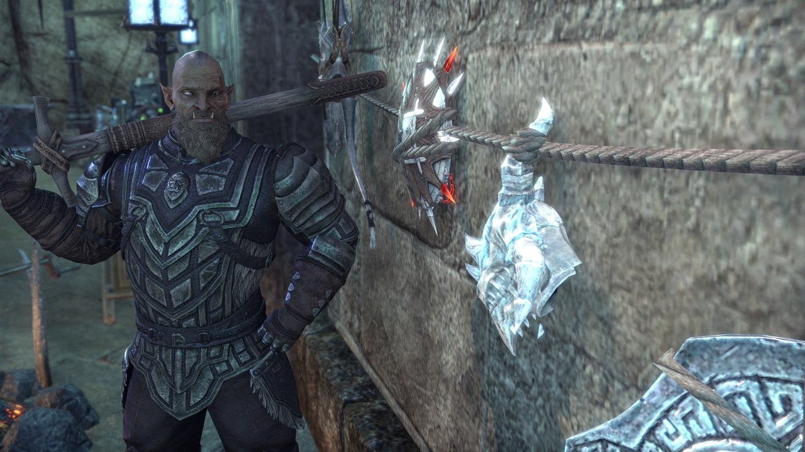

### Duelist

Виходячи з назви, такий персонаж фокусується на двобоях. Дуелісти зазвичай мають чудовий сустейн (регенерацію ресурсів), хороший відхіл та можливість завдати великої (вибухової) шкоди персонажу суперника за короткий проміжок часу – бурст. Такий персонаж має найбільшу ефективність саме в Дуелі хоча він все ще може використовуватися в інших режимах, але з певними правками: наприклад, замінивши [Sea-Serpent's Coil](https://eso-hub.com/en/sets/sea-serpents-coil) на [The Saint and the Seducer](https://eso-hub.com/en/sets/the-saint-and-the-seducer) для зняття обмежень в мобільності.

### Damage dealer

Damage dealer-ом (ДД-шкою) зазвичай називають “класичного” соло PvP-персонажа, котрого не можна віднести до іншої, специфічної, категорії. Це – *універсальний солдат*, який виконує основні задачі, необхідні для досягнення перемоги в PvP-активності: захоплює реліквії на полях битви, тримає в облозі фортеці в Сиродіілі, захищає інших союзників тощо.

Оскільки це найпопулярніша і основна роль в PvP, далі в розділі “Створення PvP-збірки” розглянуті рекомендації саме по ній.

### Support (healer)

Будь-яким damage dealer-ам потрібна підтримка і роль саппорта полягає саме в цьому: посилення союзників та послаблення суперника. Саппорти можуть завдавати шкоди, проте основний фокус їх зазвичай полягає в зціленні союзників, підтримці бафів та **HoT-ів** (**healing over time**, поступове зцілення). Саппорти часто використовують такі сети як [Robes of Transmutation](https://eso-hub.com/en/sets/robes-of-transmutation), [Powerful Assault](https://eso-hub.com/en/sets/powerful-assault), [Ozezan the Inferno](https://eso-hub.com/en/sets/ozezan-the-inferno) та здібності по типу [Siege Shield](https://eso-hub.com/en/skills/alliance-war/support/siege-shield), [Rapid Maneuver](https://eso-hub.com/en/skills/alliance-war/assault/rapid-maneuver),  [Regeneration](https://eso-hub.com/en/skills/weapon/restoration-staff/regeneration), а також інші зцілюючі та бафаючі абілки.

### Ganker

Ганкери – то є вбивці. Нехтуючи деякими захисними характеристиками, ганкер намагається завдати якомога більше шкоди в дуже короткий проміжок часу, зробивши це неочікувано, щоб вбити суперника раніше, ніж той встигне зреагувати. Це гра “в стелс” і основною перевагою ганкера є раптовість.

Ганкерів зазвичай цікавлять *легкі* цілі: гравці, що використовують облогове знаряддя, ремонтують ворота, захоплюють реліквію, фармлять Тель Вари на мобах або просто проїжджають верхи, не маючи можливість підтримувати на собі захисні бафи.

### Bomber

Бомбери – це AoE-ДД-шники, які можуть завдати великої шкоди групі суперника. Використовуючи такі сети та здібності як [Titanic Cleave](https://eso-hub.com/en/sets/titanic-cleave), [Plaguebreak](https://eso-hub.com/en/sets/plaguebreak), [Magicka Detonation](https://eso-hub.com/en/skills/alliance-war/assault/magicka-detonation), [Elemental Explosion](https://eso-hub.com/en/skills/weapon/destruction-staff/elemental-explosion) тощо, бомбери здатні вбивати велику кількість суперників одночасно.

Зворотньою стороною медалі для бомберів є поганий сустейн, відносно мала ефективність проти однієї цілі тощо.

### Scroll runner

Коли треба донести сувій в Сиродіілі, бігти необхідно далеко та робити це доведеться пішки. Scroll runner (або просто runner) здатний бігти дуже швидко на далекі дистанції. 

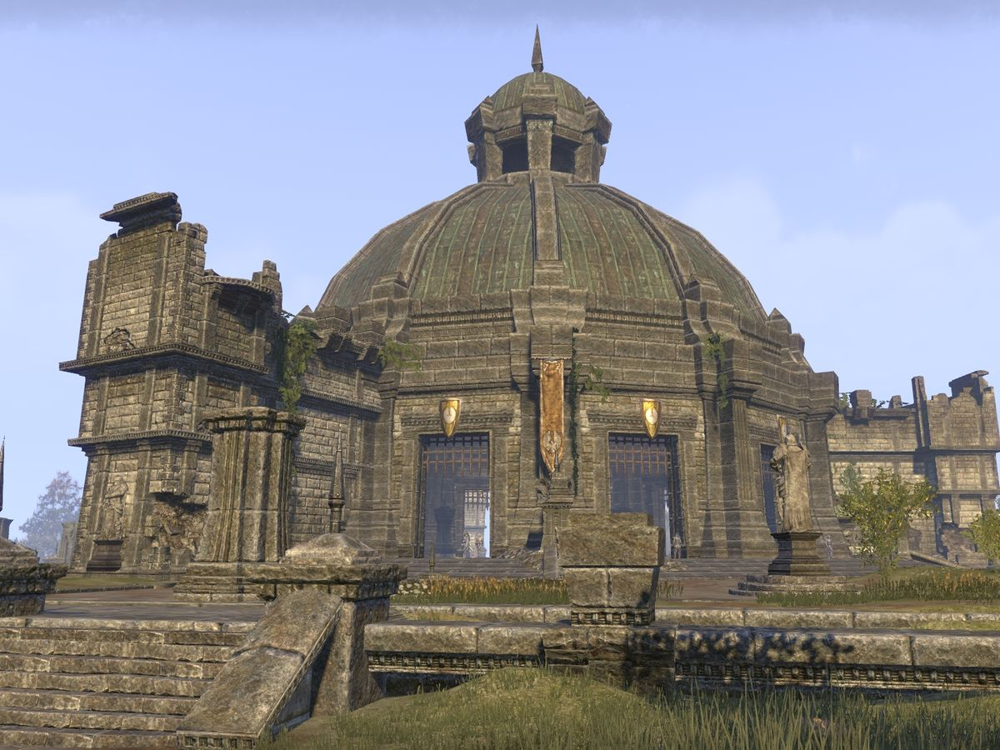

Для досягнення даної цілі, насправді, не обов’язково мати окремий білд, достатньо внести певні модифікації до існуючого, додавши [Ring of the Wild Hunt](https://eso-hub.com/en/sets/ring-of-the-wild-hunt), [Major](https://eso-hub.com/en/buffs-debuffs/major-expedition) та [Minor Expedition](https://eso-hub.com/en/buffs-debuffs/minor-expedition), взяти такі зірки як [Celerity](https://eso-hub.com/en/champion-points/star/celerity) та [Steed's Blessing](https://eso-hub.com/en/champion-points/star/steeds-blessing). Не варто нехтувати й виживанням, проте можна меншу увагу приділити демеджу.

Подібна тактика може використовуватися також на БГ при захопленні реліквії.

### Tank

Оскільки taunt-скіли на гравців не працюють, роль танка в PvP залишається достатньо сумнівною. Однак в певних випадках вони можуть працювати доволі непогано, наприклад: 

* при захопленні/захисті територій, оскільки танк може дуже довго стояти на одному місці;  
* виступати в якості приманки, фокусуючи на собі багато гравців для подальшого їх вбивства бомбером.

### Ball-group

Ball-group (BG, БГ) – це, насправді, не один білд, а набір злагоджених білдів для групи гравців. Болл-групи будуються так, щоб оптимізувати бонуси від сетів та вмінь, де кожен гравець доповнює іншого. Група соло ДД-шок ніколи не буде такою ефективною, як болл-група. Така команда здатна протистояти супернику, що в декілька разів переважатиме у кількості.

Болл-група має не тільки заготовлені збірки. Завдяки комунікації між гравцями за допомогою голосового чату, вона діє як єдиний механізм – рій, що також надає їй великої переваги.

## Створення PvP-збірки 

Розглянемо як може виглядати (соло) Damage Dealer в PvP. Білди ДД-шок в PvP зазвичай роблять універсальними: живучими і дамажними одночасно. Звісно, вони не будуть ефективні в чомусь одному, тобто PvP-шний ДД-персаж ніколи не буде наносити стільки ж шкоди, скільки його PvE-шна альтернатива, проте “скляна пушка” в PvP не працює: не буде танка, що примусово відволіче суперника і сфокусує на собі його атаки.

### Вміння

Кожний PvP-персонаж повинен при собі мати:

* бурст хіл (burst heal) – вміння, яке може швидко зцілити;  
* як мінімум один HoT;  
* бафи на посилення стійкості: [Major](https://eso-hub.com/en/buffs-debuffs/major-resolve) та [Minor Resolve](https://eso-hub.com/en/buffs-debuffs/minor-resolve);  
* бафи на підвищення СПД/ВПД (weapon/spell power damage): [Major Sorcery](https://eso-hub.com/en/buffs-debuffs/major-sorcery) та/або [Major Brutality](https://eso-hub.com/en/buffs-debuffs/major-brutality);  
* бафи на підвищення кріт-рейтингу: [Major Prophecy](https://eso-hub.com/en/buffs-debuffs/major-prophecy) та/або [Major Savagery](https://eso-hub.com/en/buffs-debuffs/major-savagery);  
* *два\-три ~~тижні~~* вміння, що завдають шкоди;  
* дебафи на пробиття стійкості суперника: [Major](https://eso-hub.com/en/buffs-debuffs/major-breach) та [Minor Breach](https://eso-hub.com/en/buffs-debuffs/minor-breach);  
* одне utility-вміння для мобільності чи інших тактичних переваг, наприклад, [Shadow Cloak](https://eso-skillbook.com/skill/shadow-cloak) чи [Bolt Escape](https://eso-hub.com/en/skills/sorcerer/storm-calling/bolt-escape).  
* один Crowd Control-скіл – стан, залякування, шарм тощо – тобто ефект, що викликає втрату контроля над персонажем суперника.

### Сети

Будь-який білд включає в себе один оборонний (defensive) та один наступальний (offensive) комплекти. Найбільш розповсюджені комбінації сетів це:

* defensive бек-бар сет (наприклад, [Wretched Vitality](https://eso-hub.com/en/sets/wretched-vitality) або [Rallying Cry](https://eso-hub.com/en/sets/rallying-cry));  
* offensive фронт-бар сет ([Order's Wrath](https://eso-hub.com/en/sets/orders-wrath), [Shattered Fate](https://eso-hub.com/en/sets/shattered-fate));  
* монстр-сет: defensive або offensive, в залежності від потреби ([Roksa the Warped](https://eso-hub.com/en/sets/roksa-the-warped), [Balorgh](https://eso-hub.com/en/sets/balorgh));  
* mythic-предмет ([Markyn Ring of Majesty](https://eso-hub.com/en/sets/markyn-ring-of-majesty), [The Saint and the Seducer](https://eso-hub.com/en/sets/the-saint-and-the-seducer));  
* один предмет з комплекту [Armor of the Trainee](https://eso-hub.com/en/sets/armor-of-the-trainee).

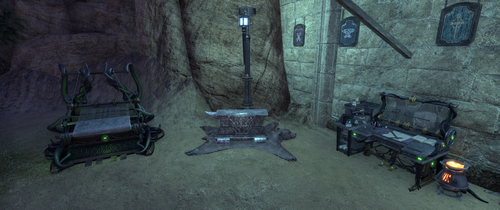

Доволі популярним в PvP є використання аренної зброї, наприклад, [(Perfected) Stinging Slashes](https://eso-hub.com/en/sets/perfected-stinging-slashes) або [(Perfected) Wrath of Elements](https://eso-hub.com/en/sets/perfected-wrath-of-elements). В такому випадку один з сетів з 5 предметів йде на тіло та з білду виключається монстр-сет або комбінація з міфіку та Trainee.

Якщо в білді використовуються дві зброї з арен (на фронт і бек барах), тоді одягають або два комплекти з 5 речей; або 1 комплект з 5 речей, монстр-сет, 1 міфік, 1 Трейні та 1 Друїд (або другий Трейні).

Звісно, то є не єдині комбінації, але найбільш популярні.

### Типи обладунків

Для комфортної гри проти гравців, найбільш ефективним є використання такої комбінації обладунків: 

* 3 важкі великі частини: обов’язково чест та 2 з наступних варіантів: штани, капелюх, наплічники, черевики;  
* 3 середні: 2 великі частини, що залишилися, та рукавиці;  
* 1 легкий пояс. 

Не завжди така комбінація виходить, якщо бажаний сет пропонує тільки 1 тип обладунків. Іноді свідомо додають більше середніх або легких для нанесення більшої шкоди. Проте 3/3/1 все ж є найбільш розповсюдженим і класичним варіантом, якого варто дотримуватися на початкових етапах гри.

### Вибір зброї

За великим рахунком, все залежить від бажаного стилю гри. Будь-яка зброя по-своєму ефективна, натомість, завдяки пасивкам на пробиття, найбільш популярною зброєю на фронт-барі є одноручні та двуручні булави. Якщо перевага віддається дистанційному бою – беруть луки та руйнівні посохи.

На бек-бар частіше беруть льодяний посох, палицю зцілення або ж щит та меч. Останній варіант хоча й має чудові пасивки, є менш популярним через обмеженість в ближньому бою, а переважну більшість часу в PvP проводять на бек-барі (детальніше див. нижче).

### Зачарування

Із зачарками на обладунки все просто – 7 прізматіків ([Prismatic Defense](https://eso-hub.com/en/enchanting-runes-and-glyphs/glyph/glyph-of-prismatic-defense/truly-superb-glyph-of-prismatic-defense)). Всі стати важливі, бо стаміна – то ролл-доджі, маджика – зцілювання, а здоров’я – то є все (також деякі щити та зцілюючі здібності скейляться від здоров’я). З ціллю зекономити, можна поставити 3 прізматіка на великі частини (тіло, ноги, голова), а всі інші – на основний стат: [Glyph of Stamina](https://eso-hub.com/en/enchanting-runes-and-glyphs/glyph/glyph-of-stamina) або [Glyph of Magicka](https://eso-hub.com/en/enchanting-runes-and-glyphs/glyph/glyph-of-magicka).

На юверіку кращим вибором будуть ґліфи на ВПД/СПД: [Magical](https://eso-hub.com/en/enchanting-runes-and-glyphs/glyph/glyph-of-increase-magical-harm/truly-superb-glyph-of-increase-magical-harm) або [Physical Harm](https://eso-hub.com/en/enchanting-runes-and-glyphs/glyph/glyph-of-increase-physical-harm). Якщо недостатня регенерація якогось з ресурсів – ґліф на сустейн: [Glyph of Magicka Recovery](https://eso-hub.com/en/enchanting-runes-and-glyphs/glyph/glyph-of-magicka-recovery) або [Glyph of Stamina Recovery](https://eso-hub.com/en/enchanting-runes-and-glyphs/glyph/glyph-of-stamina-recovery).

На бек-барі частіше використовується ґліф на ВПД/СПД – [Glyph of Weapon Damage](https://eso-hub.com/en/enchanting-runes-and-glyphs/glyph/glyph-of-weapon-damage), або отрута втікача – [Escapist's Poison IX](https://eso-hub.com/en/trading/76844/escapists-poison-ix/76844:308:50:0:0:0:0:0:0:1246464).

Для фронт-бар зброї з ґліфами трошки варіативніше і, в залежності від білда, обирається відповідна зачарка на шкоду:

* полум'я – [Glyph of Flame](https://eso-hub.com/en/enchanting-runes-and-glyphs/glyph/glyph-of-flame);  
* отрута – [Glyph of Poison](https://eso-hub.com/en/enchanting-runes-and-glyphs/glyph/glyph-of-poison);  
* поглинання стаміни – [Glyph of Absorb Stamina](https://eso-hub.com/en/enchanting-runes-and-glyphs/glyph/glyph-of-absorb-stamina) (для проку [Sundered](https://eso-hub.com/ru/status-effects/sundered) статус-ефекту);  
* нечисть – [Glyph of Foulness](https://eso-hub.com/en/enchanting-runes-and-glyphs/glyph/glyph-of-foulness);  
* шок – [Glyph of Shock](https://eso-hub.com/en/enchanting-runes-and-glyphs/glyph/glyph-of-shock);  
* лід – [Glyph of Frost](https://eso-hub.com/en/enchanting-runes-and-glyphs/glyph/glyph-of-frost).

### Трейти

В якості рис для обладунків краще обрати один з або комбінацію з:

* [Reinforced](https://eso-hub.com/en/traits/armor/reinforced) (тільки для важкої броні, в першу чергу – для честу);  
* [Impenetrable](https://eso-hub.com/en/traits/armor/impenetrable);  
* [Well-fitted](https://eso-hub.com/en/traits/armor/well-fitted);  
* [Sturdy](https://eso-hub.com/en/traits/armor/sturdy);  
* [Divines](https://eso-hub.com/en/traits/armor/divines).

*Я для себе беру зазвичай 1 Reinforced чест, 3-4 Impenetrable та 2-3 Well-fitted.*

На ювелірку краще за все підійде [Infused](https://eso-hub.com/en/traits/jewelry/infused), який підсилює зачарування. Якщо бракує мобільності, варто взяти 1 або більше предметів зі [Swift](https://eso-hub.com/en/traits/jewelry/swift). В якості альтернатив можна також розглянути [Healthy](https://eso-hub.com/en/traits/jewelry/healthy) або [Protective](https://eso-hub.com/en/traits/jewelry/protective), однак ці трейти використовуються значно рідше і мають суто захисну цінність. 

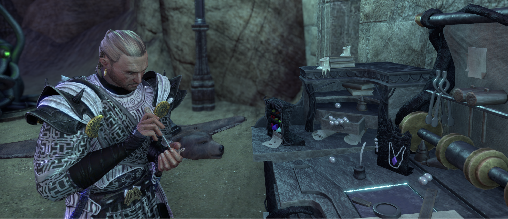

Для фронт-бар зброї найбільш ефективними є [Nirnhoned](https://eso-hub.com/en/traits/weapon/nirnhoned) та [Sharpened](https://eso-hub.com/en/traits/weapon/sharpened). В деяких випадках, якщо вистачає пробиття, можуть бути застосовані [Charged](https://eso-hub.com/en/traits/weapon/charged) або [Precise](https://eso-hub.com/en/traits/weapon/precise).

Для бек-бар зброї варто взяти [Defending](https://eso-hub.com/en/traits/weapon/defending). Якщо персонаж має багато зцілюючих ефектів, непоганим варіантом буде [Powered](https://eso-hub.com/en/traits/weapon/powered). Для щита – [Sturdy](https://eso-hub.com/en/traits/armor/sturdy).

### Мундус

Особливо уважно слід обирати Мундус, якщо білд включає в себе [Divines](https://eso-hub.com/en/traits/armor/divines) трейти. В залежності від необхідних статів використовують:

* [Warrior](https://eso-hub.com/en/mundus-stones/the-warrior) або [Apprentice](https://eso-hub.com/en/mundus-stones/the-apprentice) – збільшення ВПД або СПД (варто брати до уваги вже існуючі бафи персонажа; наприклад, ДК має [Mountain's Blessing](https://eso-hub.com/en/skills/dragonknight/earthen-heart/mountains-blessing), тому беруть Камінь Воїна навіть на магДК);  
* [Serpent](https://eso-hub.com/en/mundus-stones/the-serpent) або [Atronach](https://eso-hub.com/en/mundus-stones/the-atronach) – підвищення сустейну;  
* [Lady](https://eso-hub.com/en/mundus-stones/the-lady) – збільшення спротиву;  
* [Lover](https://eso-hub.com/en/mundus-stones/the-lover) – збільшення пробиття;  
* [Shadow](https://eso-hub.com/en/mundus-stones/the-shadow) – збільшення бурс-шкоди.

Бонуси від інших Каменів є більш специфічними та обираються рідше.

### Їжа

Найпопулярнішим вибором їжі для PvP є [Orzorga's Smoked Bear Haunch](https://eso-hub.com/en/food-drinks/delicacies/orzorgas-smoked-bear-haunch) або її дешевший аналог [Jewels of Misrule](https://eso-hub.com/en/food-drinks/delicacies/jewels-of-misrule). Тобто їжа на макс. здоров’я та сутейн.

Якщо із сустейном все добре, чудовим вибором на макс. стати може бути [Bewitched Sugar Skulls](https://eso-hub.com/en/food-drinks/delicacies/bewitched-sugar-skulls).

Якісь інші варіанти *мають* право на існування, але краще почати саме з цих та вже міняти за необхідністю.

### Зірки

В зеленій гілці зірки не дуже впливають на PvP, але деякі все ж є доволі ключовими:

* [Breakfall](https://eso-hub.com/en/champion-points/star/breakfall) – зменшення шкоди від падіння;  
* [Gifted Rider](https://eso-hub.com/en/champion-points/star/gifted-rider) – для open-world-PvP: Сиродіілу чи Імперського Міста.

Всі інші – на свій смак.

В синій гілці варто взяти 2 наступальні та 2 захисні зірки. В якості прикладу можна навести:

* [Wrathful Strikes](https://eso-hub.com/en/champion-points/star/wrathful-strikes), [Fighting Finesse](https://eso-hub.com/en/champion-points/star/fighting-finesse), [Master-at-Arms](https://eso-hub.com/en/champion-points/star/master-at-arms) – наступальні;  
* [Focused Mending](https://eso-hub.com/en/champion-points/star/focused-mending), [Ironclad](https://eso-hub.com/en/champion-points/star/ironclad), [Resilience](https://eso-hub.com/en/champion-points/star/resilience) – захисні.

Якщо не вистачає шкоди, а із виживанням все добре – можна взяти більше наступальних зірок. Якщо з виживанням гірше – додати захисних. Іноді беруть універсальні зірки, наприклад, [Untamed Aggression](https://eso-hub.com/en/champion-points/star/untamed-aggression), але вони є менш ефективними.

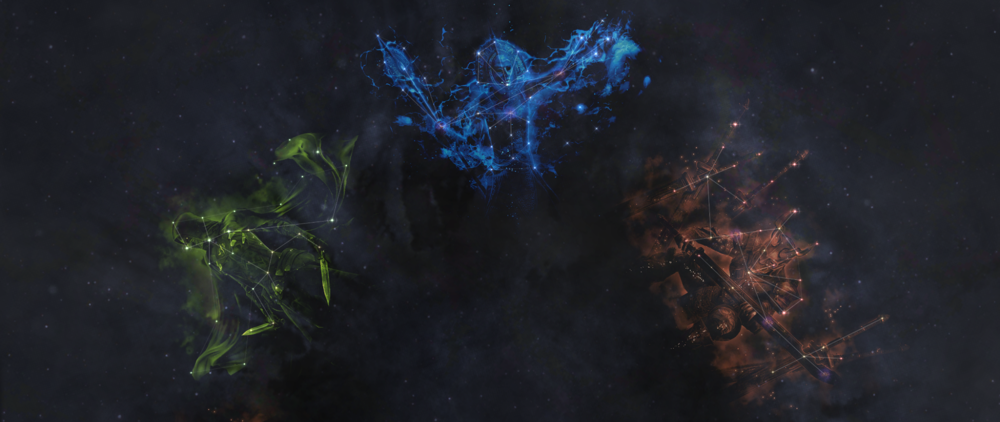

В червоній гілці зірки суто захисні та вони надають простір для вибору. В першу чергу слід розглядати такі:

* [Pain's Refuge](https://eso-hub.com/en/champion-points/star/pains-refuge) – дуже зменшує отриману шкоду в грі проти кількох суперників та/або DoT-білдів;  
* [Sustained by Suffering](https://eso-hub.com/en/champion-points/star/sustained-by-suffering) – підвищує сустейн, що напряму впливає на виживання;  
* [Survival Instincts](https://eso-hub.com/en/champion-points/star/survival-instincts) – неймовірне зниження ціни на базові бойові навички (звільнення, переривання, блок, ухиляння тощо);  
* [Celerity](https://eso-hub.com/en/champion-points/star/celerity) – підвищує швидкість, особливо цінна на персонажах ближнього бою;  
* [Fortified](https://eso-hub.com/en/champion-points/star/fortified) – збільшує спротив персонажа;  
* [Bastion](https://eso-hub.com/en/champion-points/star/bastion) – чудовий вибір як для білдів, що використовують щити, так і для гри проти них.

### Зілля

Завдяки бафам на регенерацію ресурсів, найкращим вибором зілля буде три-пот (tri-pot): [Crown Tri-Restoration Potion](https://eso-hub.com/en/crownstore/crown-tri-restoration-potion) або [Essence of Health Potion](https://benevolentbowd.ca/games/esotu/eso-alchemy-essentials-essence-of-health-potion/).

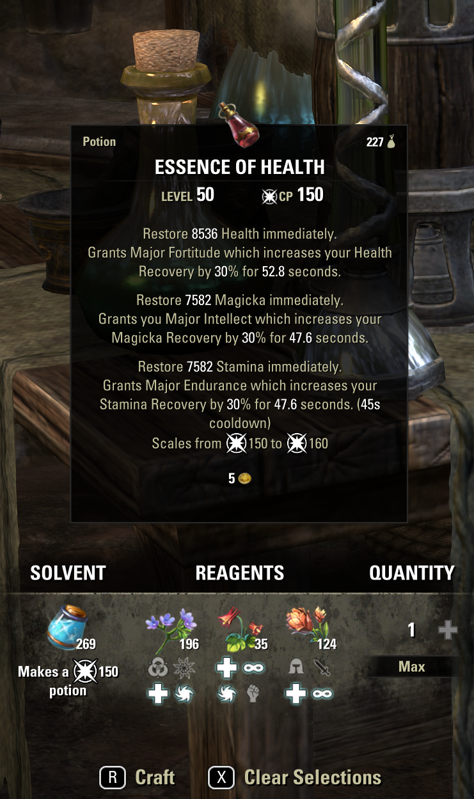

Алхімії пропонує чимало корисних варіантів, однак на початкових етапах гри  всі важливі бафи на збільшення шкоди варто отримувати з інших джерел: скілів, предметів тощо. Зілля повинні допомагати контролювати ресурси.

### Кінцеві характеристики

Залишається останній крок – атрибути. Їх варто розподіляти наступним чином: все на здоров’я, доки не набереться цільове значення (див. нижче), а решту – в основний стат.

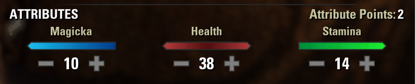

Кінцеві стати *забафаного* (спели, зілля, їжа, але без проків) персонажа виходять приблизно такі:

* 30-35 тис здоров’я;  
* 20-25 тис основного ресурсу;  
* 15-18 тис другорядного ресурсу;  
* 1.8-2.4 тис регенерації основного ресурсу;  
* 1.4-1.8 тис регенерації другорядного ресурсу;  
* 25+ тис спротиву;  
* 5-5.5 тис ВПД/СПД;  
* 25-30% кріт-шансу;  
* 5-10 тис пробиття (не враховуючи дебафів на супернику);  
* 65-75% кріт-шкоди.

Ще раз варто звернути увагу, що це – приблизні значення. Деякі білди фокусуються на чомусь більше, тому значення можуть відрізнятися. Наприклад, білд зібраний с фокусом на пробиття матиме значення цієї характеристики в межах 14-18К, але чимось іншим прийдеться жертвувати.

### Вампіризм

Вампірською хворобою, в основному, заражаються задля пасивки [Undeath](https://eso-hub.com/en/skills/world/vampire/undeath), що зменшує отриману шкоду. Але оскільки вона потребує III-стадії вампіризму, її негативною стороної є збільшення ціни не-вампірських здібностей (від пасивки [Feed](https://eso-hub.com/en/skills/world/vampire/feed)), що може суттєво погіршити сустейн.

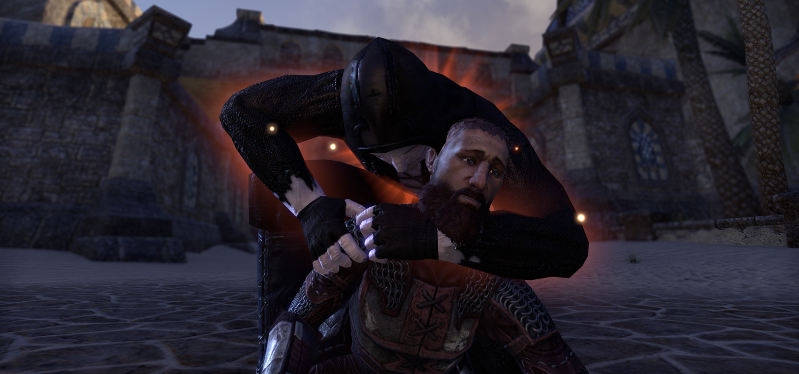

То чи варто ставати вампіром? Будь-яке зменшення шкоди не завадить і хоча вампіризм зменшує сустейн, він все ж пропонує чудовий бонус до виживання (навіть [після нерфу в u43](https://forums.elderscrollsonline.com/en/discussion/664131/pc-mac-patch-notes-v10-1-5-update-43)). Тому найпростіше рішення – спробувати пограти з III-стадією вампіризму і без неї.

Інші пасивки (на I, II та IV стадіях) також дуже непогані. Остання стадія, напевно, використовується рідше, бо *дуже ріже* сустейн, але II+ доволі часто зустрічається на ганкерах та стелс-білдах через [Strike from the Shadows](https://eso-hub.com/en/skills/world/vampire/strike-from-the-shadows), що надає бонус до шкоди після непомітності або невидимості.

Так чи інакше, бути вампіром чи ні, вирішує кожний сам для себе. Вампір пропонує дійсно непогані бонуси, але якихось “переломних” переваг наразі не має (завдяки *фіксу* абілки Undeath, яка раніше була неймовірно популярна і важлива).

### Приклади білдів

Кожний білд потребуватиме окремого гайду та пояснення, має деякі опційні здібності та інші особливості, тому нижче перелічені лише *приклади* готових білдів. Однак, враховуючи вже отримані знання, ці білди можна використовувати, адаптувавши їх під необхідний контент та стиль гри:

* [Stamina DragonKnight](https://en.uesp.net/wiki/Special:EsoBuildData?id=651760);  
* [Bow/Bow Necromancer](https://en.uesp.net/wiki/Special:EsoBuildData?id=642749);  
* [DoT Arcanist](https://en.uesp.net/wiki/Special:EsoBuildData?id=647530) (with [Dazing Soul](https://eso-hub.com/en/scribing-simulator?combination=215731,16,31,66,7&utm_medium=website&utm_source=esohubcom&utm_campaign=share_button));  
* [Magicka NightBlade](https://en.uesp.net/wiki/Special:EsoBuildData?id=652244);  
* [Stamina Sorcerer](https://en.uesp.net/wiki/Special:EsoBuildData?id=650055);  
* [Magicka Warden](https://en.uesp.net/wiki/Special:EsoBuildData?id=652390);  
* [Stamina Templar](https://en.uesp.net/wiki/Special:EsoBuildData?id=652391);  
* [Healer Sorcerer](https://en.uesp.net/wiki/Special:EsoBuildData?id=641620);  
* [Bomber NightBlade](https://en.uesp.net/wiki/Special:EsoBuildData?id=640778);  
* [Bomber DragonKnight](https://en.uesp.net/wiki/Special:EsoBuildData?id=639253);  
* [Ganker NightBlade](https://en.uesp.net/wiki/Special:EsoBuildData?id=652392);  
* [Duelist DragonKnight](https://en.uesp.net/wiki/Special:EsoBuildData?id=651128) (with [Fiery Contingency](https://eso-hub.com/en/scribing-simulator?combination=222678,8,41,58,&utm_medium=website&utm_source=esohubcom&utm_campaign=share_button)).

### Однопанельні білди

Кільце Душогуба ([Oakensoul Ring](https://eso-hub.com/en/sets/oakensoul-ring)) популярне не тільки в світі PvE – деякі гравці в PvP також його активно використовують. Чи варто воно того? З одного боку, завдяки великій кількості бафів, це доволі непоганий предмет. Персонаж отримує важливі та навіть опційні бафи весь час, поки носить це кільце і аптайм цих бонусів буде 100%.

Негативною стороною такого білда можна виділити дві речі. По-перше, обмеження в один бар. Як зазначалося вище, більшість часу персонаж проводить на бекбарі, але з Кільцем Души Нуба персонаж обмежений всього одним баром, який є одночасно і деффенсів, і оффенсів. Це означає, що персонаж змушений займати барспейс одночасно захисними і дамажними абілками, а це знижує ефективність обох. На такому барі повинні бути HoT, burst heal, 1 дамажна ульта, 2-3 дамажних скілла з дебафами та 1 ютіліті, 1 вміння на контроль. Так, виходить 7+ пунктів на 6 слотів. І навіть цієї кількості може бути замало.

По-друге, якщо уважніше придивитися до скілів, які дають бафи, можна помітити, що вони крім самого бафу дають ще щось корисне. Наприклад, [Critical Surge](https://eso-hub.com/en/skills/sorcerer/storm-calling/critical-surge) сорки крім бафів на ВПД/СПД дає ще помітний HoT. З Oakensoul-ом персонаж позбавлений такої переваги.

Висновок. Такий сетап, через Кільце, значно полегшує гру в цілому, але іншої користі чи підсилення не дає. Скоріше навпаки.

## NoCP-контент 

Деякі режими в Сиродіілі та Імперському Місті мають NoCP-компанії. Це означає, що під час гри в таких режимах, зірки (тобто чемпіонський рівень персонажа) не будуть враховуватися.

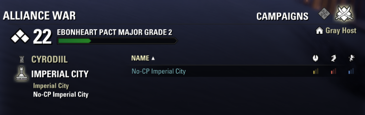

Також всі Поля Битв є NoCP-контентом. Це важливо та може впливати на білд. Наприклад, гравець може покладаються на [Sustained by Suffering](https://eso-hub.com/en/champion-points/star/sustained-by-suffering) та [Survival Instincts](https://eso-hub.com/en/champion-points/star/survival-instincts), які суттєво підвищують сустейн, та у звичайному контенті використовувати [Bewitched Sugar Skulls](https://eso-hub.com/en/food-drinks/delicacies/bewitched-sugar-skulls), але на БГ – [Orzorga's Smoked Bear](https://eso-hub.com/en/food-drinks/delicacies/orzorgas-smoked-bear-haunch).

## Battle spirit 

Важливою особливістю в PvP є перманентний баф Battle spirit, який впливає на персонажа наступним чином:

* зменшує отримане лікування на 55%;  
* зменшує регенерацію здоров’я на 50%;  
* зменшує отриману шкоду на 55%;  
* зменшує ефективність щитів 50%.

Грубо кажучи, можна уявити, що об’єм максимального здоров’я кожного персонажа в PvP збільшується вдвоє. Насправді, Battle spirit для гравця непомітний, він діє в усіх PvP-режимах та до нього швидко звикаєш і не звертаєш увагу. Однак про нього варто пам’ятати при читанні описів зцілюючих вмінь, бо ці значення варто ділити надвоє.

# Як покращити гру в PvP 

Мати чудовий збалансований білд – то лише перший крок на шляху до успіху. ESO – це action-RPG гра і чималу вагу має саме префікс *екшн*. Він означає, що на ефективність гри значно впливає досвід та вміння гравця (чи не на рівні м’язової пам'яті), реакція та здатність швидко приймати рішення тощо.

Однак не варто одразу лякатися і важливо пам'ятати, що навіть крутий досвідчений гравець колись також був новачком. Більш того, навіть *матьорі PvP-шери* помиляються та помирають. Так, вони це роблять рідше, але на їх рівні і ціна помилки досить велика: одне невірне використання ГКД (global cooldown) може вартувати життя і навіть перемоги у битві.

Отже, з чого варто почати?

## Самоаналіз 

Ключем до досягнення будь-якої цілі є *самоаналіз* та здатність до *самовдосконалення*. Elder Scrolls Online не є виключенням. Граючи в PvP будьте готові до поразок та великої кількості смертей, особливо, на початкових етапах. Якщо у вас не виходить – проаналізуйте це, зробіть висновки та попросіть поради (і перечитайте цей розділ 🙂).

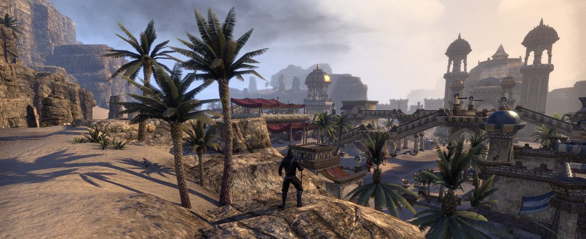

*Кожна помилка – це урок.*

Це може здаватися і без того зрозумілим, але *Самоаналіз* дійсно є чи не найголовнішим пунктом цього розділу\!

## Аптайми 

Під аптаймом мається на увазі тривалість дії бафа протягом бою у відсотках. Наприклад, бій тривав 60 секунд, 56 з яких на гравця діяв баф [Major Resolve](https://eso-hub.com/en/buffs-debuffs/major-resolve) – тоді аптайм [Major Resolve](https://eso-hub.com/en/buffs-debuffs/major-resolve) дорівнює 90%. Дуже важливим в ESO, зокрема в PvP, є аптайм бафів.

Існує така вправа. Виберіть один найважливіший баф. До прикладу, [Major Resolve](https://eso-hub.com/en/buffs-debuffs/major-resolve), що додає спротив. Протягом найближчих ігор вправляйтеся у підтримці цього бафу. Звісно, інші бафи теж повинні бути, але цей – найголовніше, що наразі необхідно. Не треба його “спамити” кожну секунду, але важливо продовжувати і намагатися досягти 100% аптайму. Ще раз, підтримка цього бафу – ваша основна задача. Не захопити фортецю, не вбити суперника, не виграти БГ – саме аптайм бафу\! Якщо ви використовуєте аддон [Combat Metrix](https://www.esoui.com/downloads/info1360-CombatMetrics.html), передивляйтеся його і аналізуйте (там є вкладка з бафами). Якщо ви померли – подивіться, чи був на вас цей баф. Якщо ні – висновок очевидний. Коли ви відчуєте, що можете аптаймити один баф – додавайте другий і так далі.

Перш ніж бурстити, незайве перевірити час, що залишається на важливих бафах та хотках (HoT), та, за необхідності, їх оновити. *Я, наприклад, маючи [Resolving Vigor](https://eso-hub.com/en/skills/alliance-war/assault/resolving-vigor), намагаюся його перекастовувти кожен раз перед бурст-комбо, бо його HoT діє лише 5 секунд.*

## Базові здібності 

Якщо ви проходили [тутор на острові Балф’єра](https://eso-hub.com/en/guides/tutorial) та билися із големом, то, напевно, пам’ятаєте, як [Норіанве](https://en.uesp.net/wiki/Online:Norianwe) вчила вас базовим механікам гри – використанню **core combat abilities**. Після чого ви отримали свої перші вміння та про ці механіки благополучно забули, аж допоки не зіштовхнулися зі складним контентом. До такого контенту можна віднести й PvP.

Для вдосконалення гри проти гравців треба вміти використовувати всі аспекти гри, у тому числі й базові механіки: ухилення, блок, ~~потужні~~ важкі атаки, баш (переривання), спрінт, снік (підкрадання) тощо. 

Вчіться вівити (weaving), блоккастити,  барсвапати та доджати під час вівінгу, а також вчасно башити (а краще вміти баш-вівити). Вівінг дуже важливий і треба давати лайт атаки навіть під час зцілювання та оновлення бафів. Буквально, кожен каст скіла повинен супроводжуватися атакою.

## Імунітет до контролю 

**Crowd control immunity** (**імунітет до контролю**, **CC immunity**) за замовчуванням дорівнює 7 секундам після закінчення CC-ефекту. Протягом цього часу на персонажа неможливо накласти ефект, що викликає втрату контролю. Якщо ви отримали CC immunity – це непогана спроба забурстити суперника. Намагайтеся відслідковувати CC immunity, принаймні на собі.

*Непоганою ідеєю перед бурст-комбо є використання Immovability pots – зілля, що надає CC-immunity. Проте не забувайте, що таким чином можете втратити важливий баф на регенерацію ресурсів, що дає трі-пот.*

## Бурст 

Оскільки гравці вміють лікуватися, ухилятися від атак та звільнятися від контролю, в грі проти них важливим є не середнє значення шкоди в секунду протягом бою (DPS), а кількість шкоди, яку персонаж наносить за короткий інтервал часу – бурст.

Привчається до таймінгів своїх дамажних вмінь, а також слідкуйте за ротацією. Корисно час від часу тренуватися на манекені чи мобах, а за можливістю – в дуелі з партнером.

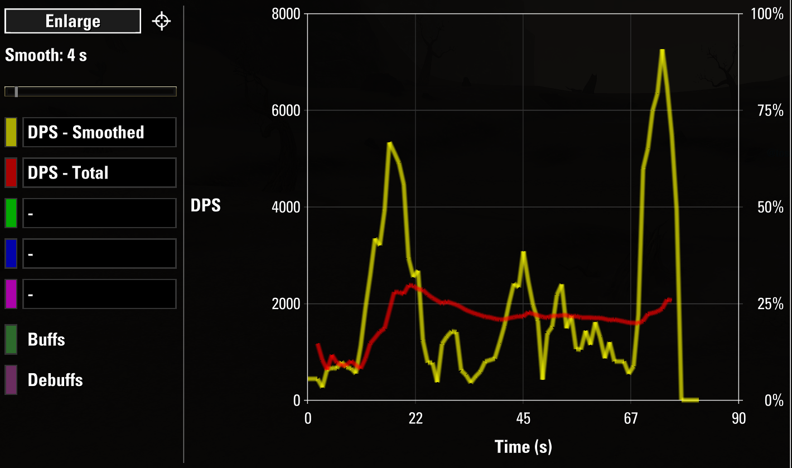

*Це графік нанесення шкоди в дуелі. На ньому можна побачити як змінювався DPS протягом бою (жовтий) та середнє значення шкоди в секунду (червоний). Друга спроба бурсту виявилася вдалою та суперник був подоланий, хоча середнє значення DPS є доволі невеликим.*

## Контроль ресурсів 

PvP в ESO – то гра в ресурси. Всього ресурсів три: стаміна, маджика та здоров’я. Намагайтеся не доводити жоден з ресурсів до мінімуму.

Припустимо, вас намагаються забурстити після того, як ви вже зробили пару доджів. Якщо зробите ще один, то сильно “просядете” по стаміні і наступний стан виявиться летальним. В цьому випадку, варто спробувати заблокувати та перехілити бурст, роблячи ставку на ману. І навпаки, маючи не багато мани, не варто намагатися зцілитись: 1-2 доджа врятують від бурстових комбінацій суперника, а до того часу вже відновиться мана або зілля.

*Можливо ви помітили, що в розділі “Як білдитися для PvP” відсутня одна деталь кожної збірки – раса. Це зроблено не випадково. На мою думку, будь-яка раса має свої переваги в PvP і будь-які расові бонуси можна ефективно використовувати (якщо, звісно, не мінмаксити).*

## Контроль суперника 

В PvP стани дають ДД-шки для нанесення своєї бурстової шкоди.

Оскільки гравці можуть звільнитися від ефекту контролю, виникає питання: коли та як давати контроль? Відповідь криється в попередньому пункті. Якщо вам не вдається швидко подолати суперника (або йому вас), починається гра “в ресурси” і хто перший по ним “просяде”, той зазнає поразки.

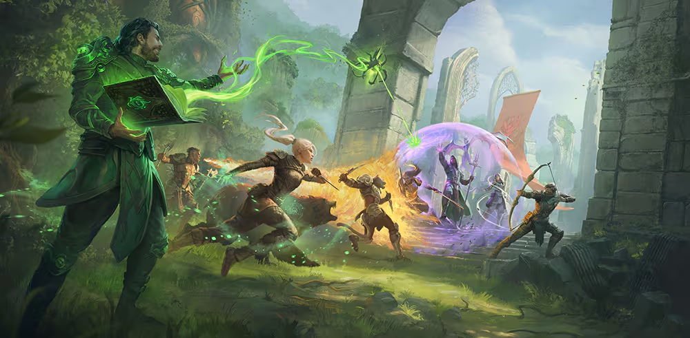

Інакше кажучи, на початку бійки намагайтеся давати CC тільки коли готові бурстити. Якщо забурстити не виходить – грайте в ресурси, змушуючи суперника зайвий раз витратити ресурси на звільнення та перекати.

Контроль також може бути доречним для захисту від бурсту суперника: коли ви знаєте, що він от-от піде “all-in” – застаньте його. Це змусить суперника не тільки витрачати ресурси на визволення, але й зіб’є його таймінги. Така тактика потребує певного досвіду і розуміння білду опонента, але все прийде з практикою.

## Двобої 

Дуельтеся\! Багато дуельтеся\! На початку може бути складно битися проти більш досвідчених гравців в Алік’рі, тож буде чудово, якщо ви знайдете собі партнера приблизно вашого рівня гри, з якими зможете регулярно тренуватися в двобоях. Сприймайте такі дуелі як тренування (а не змагання) і чудовий спосіб спробувати нові тактичні прийоми.

## Гра в малих групах 

Дуже допомагає практика гри в групі з 3-4 гравців. Ваші союзники можуть вас зцілити, забафати та якщо вам важко самому забурстити суперника – підтримати вас в цьому. Також це допомагає вчитися переживати бурст, коли на вас фокусуються декілька суперників. В більших групах контролювати ситуацію складніше, тож краще тренуватися саме в таких.

Найкращим прикладом гри в малій групі є БГ 4v4, оскільки вони мають мінімальну кількість відволікаючих факторів. Ходіть на такі БГ і намагайтеся грати в команді, та намагайтеся від таких походів отримати саме досвід PvP\! Звісно, хочеться виграти, захопивши всі території та реліквії, але це вас не вчить битися. Приділіть увагу саме грі проти гравців в першу чергу.

## Використання ландшафту 

Вірним способом захиститися від бурсту є, як би то банально не звучало, не дати супернику це зробити – не дати на це часу. Намагайтеся бігати біля стін чи інших об’єктів та мінімізувати час потрапляння в область бачення суперника. Це не дасть йому змоги нанести вам багато шкоди за раз.

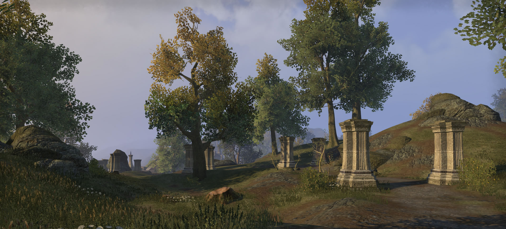

Перш ніж вступати в бійку, подивіться навколо і одразу знайдіть місце, куди можна сховатися. Іноді, сховавшись на декілька секунд  за деревом, камінцем або стовпчиком, цього більш ніж достатньо для того, щоб зцілитися та відновити ресурси. Використовуйте будь-яку можливість\!

## Оновлення збірки 

Будь-яка ваша збірка повинна пройти перевірку часом. Буває так, що на папері все виглядає чудово, але на практиці виявляється неефективним. Це нормально, тому завжди варто за необхідності оновлювати свої білди: їжу, мундус, зачарування, трейти, а іноді й навіть цілі сети.

Наприклад, якщо ви розумієте, що вам не вистачає ресурсів, а всі ваші зачарування на ювелірку стоять на ВПД/СПД – замініть їх (по одному, не обов’язково всі одразу). Можливо, ви маєте мундус Воїна та заміна його на Атронаха допоможе. І так далі. 

Якщо ви зробили білд, спираючись на збірку іншого гравця – можливо вам підходить інший плейстайл – переробіть її так, щоб було зручно вам.

*До будь-якої нової збірки треба звикнути, то ж не завжди варто робити поспішні висновки. Дайте їй трохи часу і “приграйтеся”, а тоді точніше зрозумієте, що саме “не так”.*

## NoProc сети 

Дуже корисним є використання NoProc сетів  – тих, що дають постійні бонуси. Так ви можете краще зрозуміти як бурстити і виживати, не покладаючись на побічні ефекти ваших артефактів. Раджу пограти з такими сетами, тоді подальше використання прокових буде сприйматися як перевага та сильно полегшить гру.

Непоганими прикладами noProc сетів є [Order's Wrath](https://eso-hub.com/en/sets/orders-wrath), [Law of Julianos](https://eso-hub.com/en/sets/law-of-julianos), [Leviathan](https://eso-hub.com/en/sets/leviathan) / [Mother's Sorrow](https://eso-hub.com/en/sets/mothers-sorrow), [Crafty Alfiq](https://eso-hub.com/en/sets/crafty-alfiq) / [Draugr Hulk](https://eso-hub.com/en/sets/draugr-hulk), [Shattered Fate](https://eso-hub.com/en/sets/shattered-fate), [Draugrkin's Grip](https://eso-hub.com/en/sets/draugrkins-grip) або навіть [Torc of the Last Ayleid King](https://eso-hub.com/en/sets/torc-of-the-last-ayleid-king).

## NoCp-контент 

Корисною практикою також є гра в noCP-контент. І хоча наразі там вже працюють proc-сети, гра “без зірок” так само допомагає покладатися на базові аспекти білду.

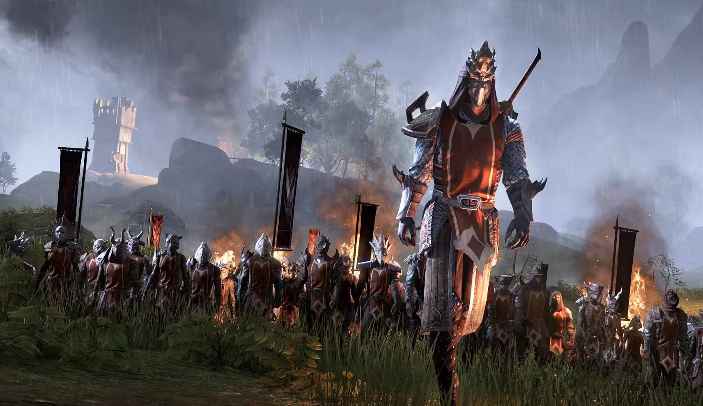

*Це як тренування професійних спортсменів на висоті  для підвищення витривалості на рівнині. Оскільки чим вище піднімається спортсмен – тим гірше м’язи насичуються киснем. Якщо він тренується в складних умовах, йому буде легше на змаганнях, в звичайних умовах (в CP-контенті 😉 ).* 

## Зміна ролей 

Коли ви достатньо часу пограли однією збіркою, варто спробувати щось інше. По-перше, це дасть змогу краще зрозуміти чим грають ваші суперники, побачити потенційні переваги та недоліки їх білдів. По-друге, це розвиває ваше розуміння гри: оскільки на новому білді, допоки ви ще звикаєте до скілів, вам доведеться покладатися на базові механіки, тактику та ландшафт. І наостанок, можливо новий  білд вам сподобається більше.

Коли ви достатньо часу пограєте різними білдами на ДД-шок, спробуйте інші ролі: бомберів, хіллерів тощо. Геймплей на них може дуже відрізнятися.

*Це все розвиває вас і відкриває нові аспекти PvP в Elder Scrolls Online, але то вже теми для наступних дискусій і постів…*